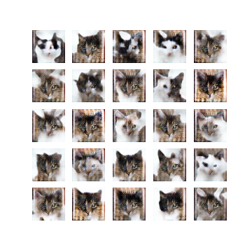
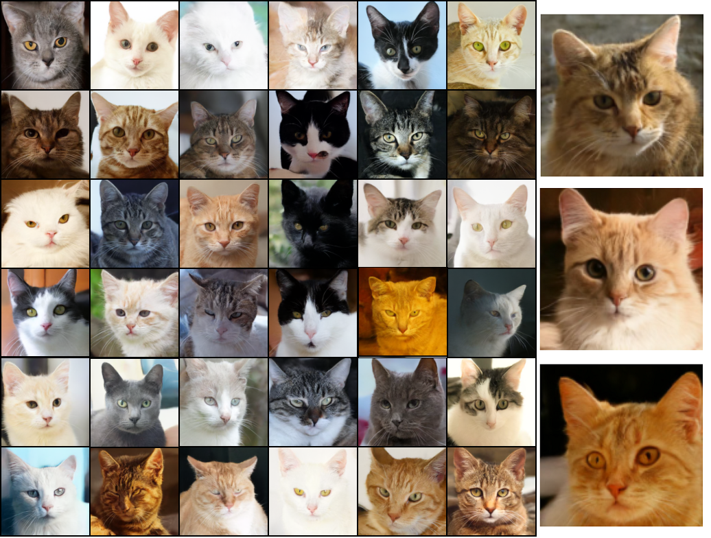

## Best Practises to Train and Control DCGAN

### Abstract 📑

GAN training can be tricky and very sensitive. It is still an active research domain to achieve a stable and consistent training method for GANs. This work mainly focuses on DC-GANs and the best practices that can be followed for stable GAN training. The manuscript dives into the hyperparameters and architectural choices to optimize the min-max game for stable nash equilibrium. Common pitfalls and challenges in training are discussed, and possible solutions to overcome the same. A comprehensive guide to stable and consistent GAN training is the main focus of this work. We also explore the controllability of the generator's output by achieving disentanglement in DC-GANs. Finally, compare various architectures and designs of DC-GANs to arrive at a recommendable design choice for a stable GAN training.

### Results 📈

A sample generation of cats when trained with a set of CAT faces ONLY

Final Samples of Cat Images (Diffusion based trained)

