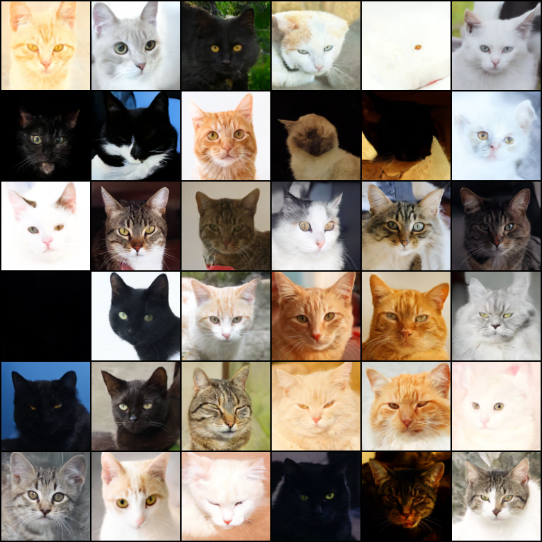
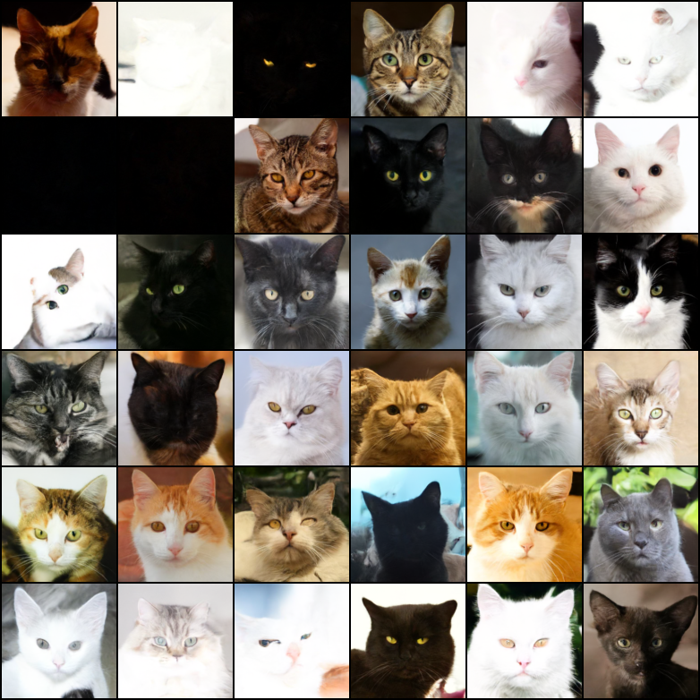
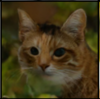
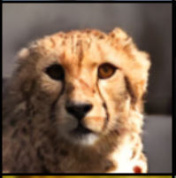
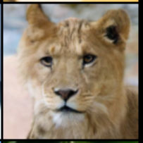

## Implementation of Diffusion Model for Content Generation with Markov Noise Corruption Process

### Abstract 📑

GAN training can be tricky and very sensitive. It gets extremely difficult to choose the working hyper parameters and training parameters. Diffusion Models have picked up a lot of attention when it came to stable and reliable content generation. 
There has been a lot of work that proves diffusion model's dominance over GANs when it comes to realistic image generations. This work focuses on implementing the same in pytorch.
We specifically aim to bring out the user perspective when working with diffusion models. 

### Results 📈

Sample generation of cats when trained with a set of CAT faces ONLY

A sample generation of cats when trained with a set of CAT (set of 5000) and WILD ANIMAL (set of 5000) and DOG (set of 5000) faces

A sample generation of cheetah when trained with a set of CAT (set of 5000) and WILD ANIMAL (set of 5000) and DOG (set of 5000) faces

A sample generation of lion when trained with a set of CAT (set of 5000) and WILD ANIMAL (set of 5000) and DOG (set of 5000) faces

