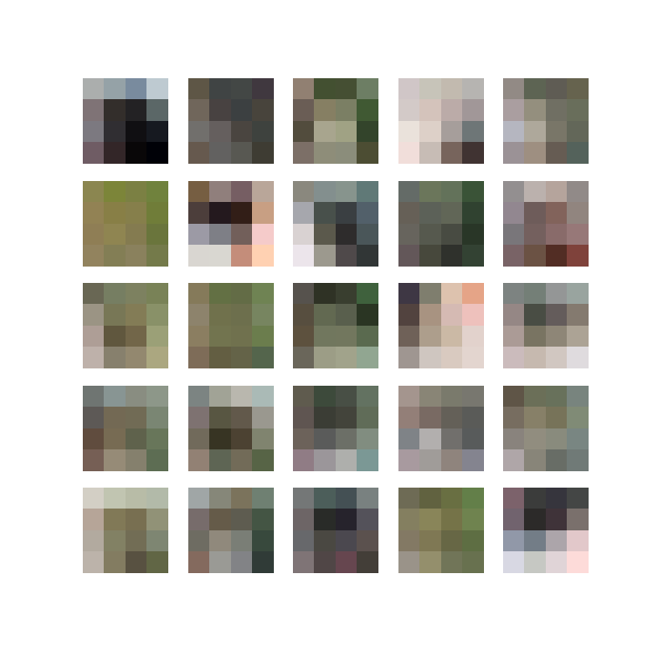
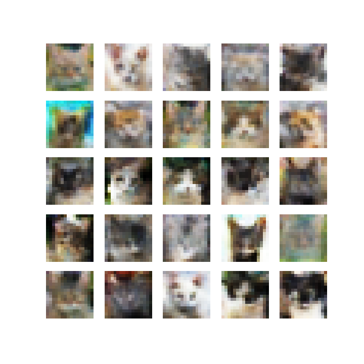
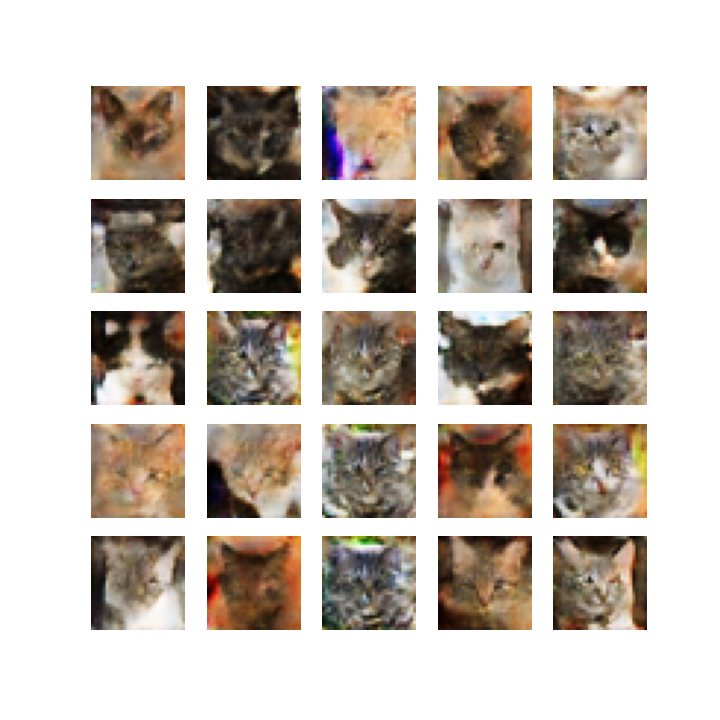
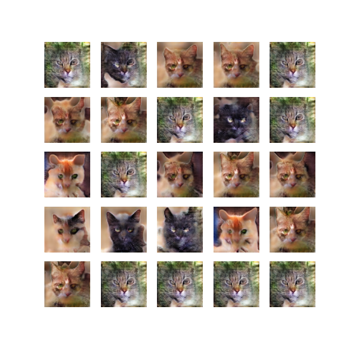
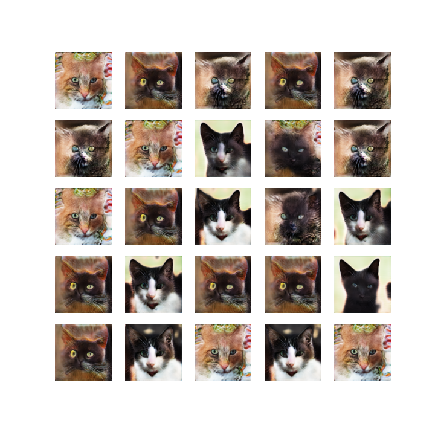
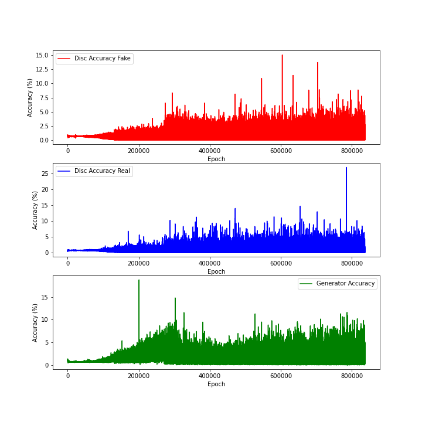

## Implementation of Progressively Growing GAN for High Definition Content Generation

### Abstract 📑

Generative Adversarial Networks are very useful for content generation, but are really effective in lower resolutions. Training a GAN directly to generate in high dimensions (128x128 and above) is very tricky and difficult with general usage GPUs.   

This work attempts to train a GAN network from lower dimensions (4x4) and progressively increase the resolution by means of transfer learning. This allows the network to learn faster and generate in higher dimensions more effectively.

### Results 🎯

A sample generation of random animals (sometimes non-existant species because the training was done on cats, dogs and wild animals together) in progressing dimensions.  

1. 4x4

2. 8x8

3. 16x16

4. 32x32

5. 64x64

6. 128x128

### Training Curves 📈

As can be seen, the model has a potential for higher accuracies. The model was currently trained on 16000 samples for 46 hours on an Nvidia P2000 GPU. One can leave the training for longer duration and on higher capacity GPUs for better results. Currently we are running the algorithm on Discovery Cluster of Northeastern University.

